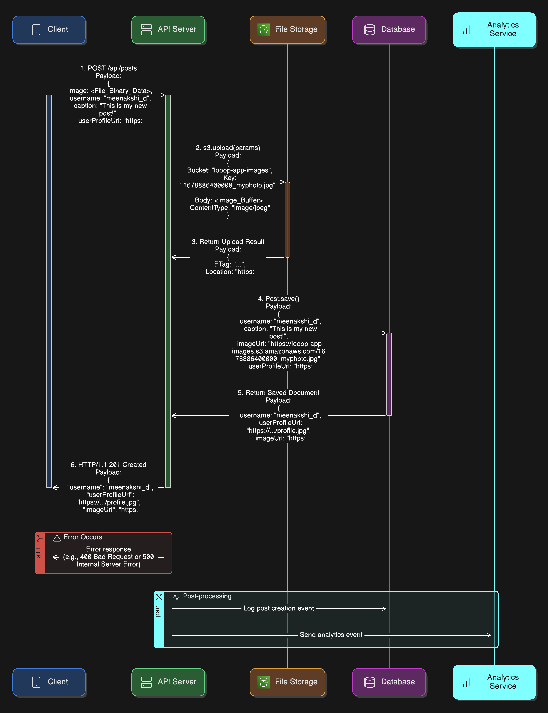

### How to Get It Running (The Fun Part!)

**Step 1: Set up AWS**
Follow the detailed instructions I put in the `AWS_SETUP_GUIDE.md` file. It'll walk you through creating the S3 bucket and getting your secret keys.

**Step 2: Set up the Project**
1.  Open your terminal and run `npm install`. This will download all the necessary code packages.
2.  Find the file named `env.example`. Make a copy of it and rename the copy to just `.env`.
3.  Open the new `.env` file and paste in all your secret keys from MongoDB and AWS.

**Step 3: Start the Server!**
That's it! Just run `npm start` in your terminal. You should see a message saying the server and database are connected.

### How to Test It (Without Postman!)

I included a special test page to make testing easy.
1.  Make sure the server is running.
2.  Find the file `test.html` in the project folder.
3.  Just double-click to open it in your web browser (like Chrome).
4.  You'll see a nice form. Choose an image, write a caption, and hit "Upload Post".

If it works, you'll see a page with some JSON text. That means the post was created, the image was uploaded to your S3 bucket, and the post details were saved to your MongoDB database.

## Architecture Diagrams

Here are the architecture diagrams for this project:

